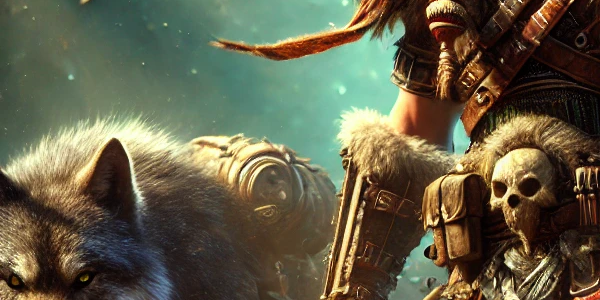

# Specs

## Survival

[**Talents**](<https://www.wowhead.com/cata/talent-calc/hunter/03-2302-23203003023022121311_001xjt11xjv21qg031qgc41xke51qgs61rhg71rhf81rga>)

### Explosive Shot clipping has been fixed

- "*434*" is back as "***444***"!
- We can now chain ES casts without filler or delay, without clipping ticks.
- Be aware that four ES casts in a row can still clip one tick.
- This is not meant to be a buff - it is a fix to a major bug that caused us to deal less damage than intended for the past 6 months.
- The way it's been fixed is convenient and now works similar to how it will in MOP.
- The DPS gain is sub 1% under optimal conditions!
- No special macro is needed - just cast ES.
**NO, THIS IS NOT ABOUT HASTE!...**

## Glyph Options in Firelands

### Shannox, Baleroc, Majordomo

Use Glyph of Arcane Shot if you want to, it's slightly higher dps

### Everything else (including trash)

Use Glyph of Serpent Sting

### Remember: not swapping back to Glyph of Serpent Sting after those bosses is a loss on the rest of the bosses and trash

## Marksmanship

# [Talents](<https://www.wowhead.com/cata/talent-calc/hunter/032002-2302321132120231201-03_001qg911qfw21qft31qgc41xke51qgs61rhg71rhf81rga>)

## Beast Mastery

# [Talents](<https://www.wowhead.com/cata/talent-calc/hunter/2330230311320112121-2302-03_001qg911qga21xjv31qgc41xke51qfy61rhg71rhf81rga>)
